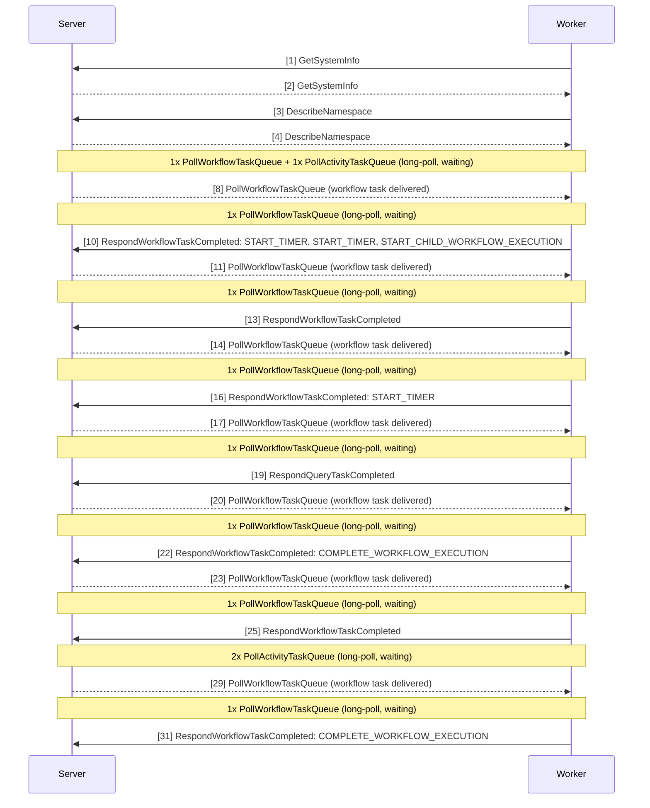

```mermaid
sequenceDiagram
    participant Server
    participant Worker

    Worker->>Server: [1] GetSystemInfo
    Server-->>Worker: [2] GetSystemInfo
    Worker->>Server: [3] DescribeNamespace
    Server-->>Worker: [4] DescribeNamespace
    Note over Worker,Server: 1x PollWorkflowTaskQueue + 1x PollActivityTaskQueue (long-poll, waiting)
    Server-->>Worker: [8] PollWorkflowTaskQueue (workflow task delivered)
    Note over Worker,Server: 1x PollWorkflowTaskQueue (long-poll, waiting)
    Worker->>Server: [10] RespondWorkflowTaskCompleted: START_TIMER, START_TIMER, START_CHILD_WORKFLOW_EXECUTION
    Server-->>Worker: [11] PollWorkflowTaskQueue (workflow task delivered)
    Note over Worker,Server: 1x PollWorkflowTaskQueue (long-poll, waiting)
    Worker->>Server: [13] RespondWorkflowTaskCompleted
    Server-->>Worker: [14] PollWorkflowTaskQueue (workflow task delivered)
    Note over Worker,Server: 1x PollWorkflowTaskQueue (long-poll, waiting)
    Worker->>Server: [16] RespondWorkflowTaskCompleted: START_TIMER
    Server-->>Worker: [17] PollWorkflowTaskQueue (workflow task delivered)
    Note over Worker,Server: 1x PollWorkflowTaskQueue (long-poll, waiting)
    Worker->>Server: [19] RespondQueryTaskCompleted
    Server-->>Worker: [20] PollWorkflowTaskQueue (workflow task delivered)
    Note over Worker,Server: 1x PollWorkflowTaskQueue (long-poll, waiting)
    Worker->>Server: [22] RespondWorkflowTaskCompleted: COMPLETE_WORKFLOW_EXECUTION
    Server-->>Worker: [23] PollWorkflowTaskQueue (workflow task delivered)
    Note over Worker,Server: 1x PollWorkflowTaskQueue (long-poll, waiting)
    Worker->>Server: [25] RespondWorkflowTaskCompleted
    Note over Worker,Server: 2x PollActivityTaskQueue (long-poll, waiting)
    Server-->>Worker: [29] PollWorkflowTaskQueue (workflow task delivered)
    Note over Worker,Server: 1x PollWorkflowTaskQueue (long-poll, waiting)
    Worker->>Server: [31] RespondWorkflowTaskCompleted: COMPLETE_WORKFLOW_EXECUTION
```
