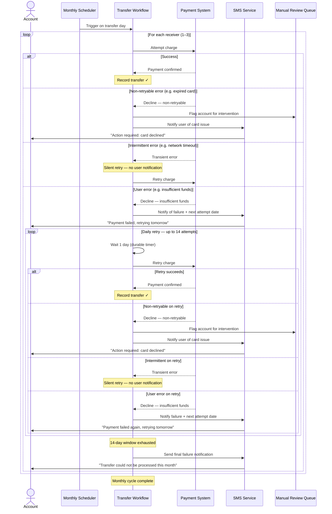

## Workflow Implementations

Four approaches are provided, each demonstrating a different Temporal pattern for the daily retry logic.

### Approach 1: Flat workflow (`workflows.ts`)

A single workflow processes all receivers via `Promise.all`. Daily retries are a manual `for` loop with `sleep('1 min')`.

| | |
|---|---|
| **Pros** | Simplest code; one file; easy to reason about locally |
| **Cons** | Every `sleep()` and activity call adds events to a single shared history — with 3 receivers × 14 retries, ~300+ events accumulate in one workflow. Harder to debug per-receiver progress in the UI. History can approach Temporal's limits at scale. |

### Approach 2: Child workflows with manual retry loop (`workflows-child.ts`)

Parent spawns one child per receiver via `executeChild`. Each child owns its lifecycle including a manual `for` + `sleep` loop — identical retry logic to approach 1 but scoped per receiver.

| | |
|---|---|
| **Pros** | Each receiver has its own event history and Workflow ID — independently visible and debuggable in the Temporal UI. One child failing doesn't affect siblings. |
| **Cons** | Still reinvents retry logic with a `sleep` loop. Each child's history still grows with timer and activity events per daily attempt. More code than approach 1 for the same retry pattern. |

### Approach 3: Child workflows with Temporal retry policy (`workflows-child-retry-policy.ts`)

Parent spawns children with a `retry` policy on `executeChild`. Each child does a single attempt and throws `ApplicationFailure` on user errors, letting Temporal retry the entire child workflow on the configured interval.

| | |
|---|---|
| **Pros** | Minimal event history — each child execution is just one attempt; retries are new workflow runs with their own tiny histories. Retry schedule is declarative config, not imperative code. Per-receiver visibility in the UI via Workflow IDs. |
| **Cons** | State is lost between retries (each retry is a fresh execution). Per-retry SMS notifications work via `workflowInfo().attempt`, but complex branching across retries gets awkward. Requires throwing `ApplicationFailure` specifically — a regular `Error` causes infinite workflow task retries, not workflow retries. |

### Approach 4: Flat workflow with activity-level retry policy (`workflows-activity-retry.ts`)

A single flat workflow uses two proxy configs for `processPayment`: one for fast intermittent retries, one that lets Temporal retry user errors on a daily interval. No child workflows, no `sleep` loops.

| | |
|---|---|
| **Pros** | Fewest events of all approaches — activity retries are handled entirely server-side and add zero entries to workflow history regardless of retry count. No child workflow overhead. Simplest workflow structure. **This is the approach Temporal recommends** when you don't need per-item Workflow ID isolation. |
| **Cons** | The workflow is dormant while the activity retries, so it cannot send an SMS between each daily attempt. Instead, one upfront "we'll retry daily" SMS is sent, and one final outcome SMS. Exact attempt count on success requires the activity to return its own attempt counter. |

---

## Use case

We are creating an application that will allow a user to make a payment to up to 3 receivers once a month. Each month on a specified day it will make between 1–3 transfers from their account to the receivers. The transfers are processed using a payment system.

Payment system debit attempts should:
  - Retry once a day for 14 days
  - Notify the user of the failure via SMS and next attempt (This is for user relevant errors eg. insufficient funds)
  - If the error is non-retryable (eg. expired card) flag the account for manual intervention
  - If the error is intermittent (eg internal network error) retry without notifying the user.

